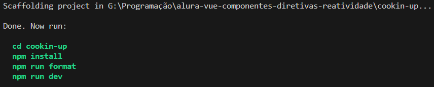

# Curso  : Vue 3 - Componentes, Diretivas e Reatividade no Framework
Repositório para guardas as anotações e prática do curso da Alura Vue 3: Entendendo Componentes, Diretivas e Reatividade no Framework

| :placard: Vitrine.Dev |     |
| -------------  | --- |
| :sparkles: Nome        | **Curso Alura : Vue 3 - Componentes, Diretivas e Reatividade no Framework**
| :label: Tecnologias | TypeScript, VueJs
| :rocket: URL         | 

<!-- Inserir imagem com a #vitrinedev ao final do link -->


## Conteúdos
* [Para Rodar o Projeto](#-para-rodar-o-projeto)
* [Links](#links)
* [Detalhes do Projeto](#-detalhes-do-projeto)
    * [Iniciando um Projeto Vue](#iniciando-um-projeto-vue)
    * [Extensões úteis do VSCode](#extensões-úteis-do-vscode)
    * [Preparação Inicial](#preparação-inicial)
    * [O básico do Vue](#o-básico-do-vue)
    * [A estrutura de um componente Vue](#a-estrutura-de-um-componente-vue)
    * [Importando componentes dentro de outro componente](#importando-componentes-dentro-de-outro-componente)
    * [Diretivas Vue](#diretivas-vue)
    * [Importando Dados](#importando-dados)
    * [Consumindo dados de uma API](#consumindo-dados-de-uma-api)

<p align="right"><a href="#curso---vue-3---componentes-diretivas-e-reatividade-no-framework">⬆️Topo⬆️</a></p>


## 📀 Para rodar o projeto
- Clonar o repositório;
- Entrar na pasta __cookin-up__ com ```cd cookin-up```;
- Instalar as dependências necessárias ```npm install```;
- Rode o projeto com o comando ```npm run dev``` e o app estará rodando no servidor local na porta __5173__ (http://localhost:5173/).

<p align="right"><a href="#curso---vue-3---componentes-diretivas-e-reatividade-no-framework">⬆️Topo⬆️</a></p>


## Links
- A parte prática do curso envolve o desenvolvimento de um aplicativo chamado CookinUp. [Este é o arquivo Figma do Projeto](https://www.figma.com/file/J4J2EY9BDJKYueH7QGrsnz/Cookin'UP-%7C-Vue-1-(Copy)?type=design&node-id=1901-2&mode=design&t=odeZYaNpiVTuXDSt-0);
- [Documentação do Vue](https://br.vuejs.org/v2/guide/index.html);
- [Projeto final do instrutor](https://github.com/alura-cursos/cookin-up/tree/main).
- [Artigo da Alura sobre o ciclo de vida dos componentes em Vue](https://www.alura.com.br/artigos/vuejs-ciclo-vida-componentes)

<p align="right"><a href="#curso---vue-3---componentes-diretivas-e-reatividade-no-framework">⬆️Topo⬆️</a></p>


## 🗈 Detalhes do projeto
Este projeto é o meu primeiro contato com o Framework Vue. Nesta seção tentarei colocar o passo a passo do que foi feito, para usar de referência para projetos futuros em VueJs.


### Iniciando um projeto Vue
1. É necessário ter o __Node__ instalado;
2. Na linha de comando do diretório inicial, usar o comando ```npm create vue```;
3. Como nenhuma versão específica do Vue foi exigida no comando, ele pedirá para confirmar a versão mais recente (no meu caso a @3.9.2).

4. Ao confirmar, as perguntas básicas de criação de projeto serão apresentadas:

5. O projeto será criado na pasta com o nome informado ("Project name", no meu caso, "cookin-up") e serão apresentadas os próximos comandos para abrir o projeto e instalar as dependências iniciais:

```cmd
<!-- No prompt de comando -->
cd cookin-up
npm install
npm run format
npm run dev
```
6. Ao inserir os comandos, um servidor local será criado, na porta __5173__ o app básico será iniciado:


<p align="right"><a href="#curso---vue-3---componentes-diretivas-e-reatividade-no-framework">⬆️Topo⬆️</a></p>


### Extensões Úteis do VSCode
O instrutor recomenda a instalação das seguintes extensões do VSCode para facilitar o trabalho com o framework Vue:
- Vue Language Features (Volar)
- TypeScript Vue Plugin (Volar)

<p align="right"><a href="#curso---vue-3---componentes-diretivas-e-reatividade-no-framework">⬆️Topo⬆️</a></p>

### Preparação Inicial
Conforme indicado pelo instrutor, alguns arquivos podem ser deletados e/ou alterados, para a criação do app **cookin´up**, então foram tomados os seguintes passos inicias na pasta gerada pelo Vue:
1. Todos os componentes da pasta ```src/components``` foram deletados;
2. Na pasta ```src/assets``` foram deletados os arquivos *base.css* e *logo.svg*, foram colocadas aqui a pasta das imagens que será usada no projeto e o arquivo *main.css* foi alterado de acordo com definições pré-estabelecidas;
3. No arquivo *index.html*, na tag ```<head>```, foi importada as fontes que serão utilizadas (Nunito Sans e Paytone One) e o título da página foi alterado para "Cookin´Up"; aqui também tomei a liberdade de trocar o favicon por um ícone retirado do Figma;
4. No arquivo *App.vue*, que é o componente principal de renderização do framework, o código foi trocado para apenas uma saudação.
5. Como passo opcional o instrutor recomenda ativar o "Modo de Aquisição" (ou "Takeover Mode") da extensão Volar para melhorar o desempenho do Vue com Typescript, que demanda os seguintes passos:
    1. Acionar a paleta de comando com Ctrl + Shift + P;
    2. Digite built e selecione "Extensions: Show Built-in Extensions";
    3. Digite typescript na caixa de pesquisa de extensão (não remova o prefixo @builtin).
    4. Clique no pequeno ícone de engrenagem da "TypeScript and JavaScript Language Features" e selecione "Disable (Workspace)".
    5. Recarregue o VSCode.

<p align="right"><a href="#curso---vue-3---componentes-diretivas-e-reatividade-no-framework">⬆️Topo⬆️</a></p>


### O básico do Vue
Como boa parte dos frameworks de front end, o Vue usa a geração de html dinamicamente através de javascript. Vamos passar pelos arquivos principais para ter uma ideia de como isso é feito:

#### index.html
```html
<!DOCTYPE html>
<html lang="pt-br">
  <head>
    (...)
  </head>
  <body>
    <div id="app"></div>
    <!-- Esta <div> será usada como tag pai de todos os componentes do aplicativo Vue, em especial o componente principal, App.vue, por isso é importante que sua identificação serja alterada com muito cuidado -->
    <script type="module" src="/src/main.ts"></script>
    <!-- Este script indica o arquivo principal do app, o main.ts, que é o responsável por criar/renderizar dinamicamente os componentes em html -->
  </body>
</html>
```

#### main.ts
```ts
import './assets/main.css'

import { createApp } from 'vue'
// O código acima é principalmente a importação dos objetos/funções principais do Vue.
import App from './App.vue'
// Importação do componente principal do vue, o App

createApp(App).mount('#app')
// Aqui está a ação principal do vue, onde o componente App é efetivamente criado como html/css/js e montado na div principal (com o id="app")
```

#### App.vue
```vue
<template>
  <h1>Meu primeiro projeto Vue!</h1>
  <!-- tags html a serem inseridas quando o componente for chamado -->
</template>
```

<p align="right"><a href="#curso---vue-3---componentes-diretivas-e-reatividade-no-framework">⬆️Topo⬆️</a></p>


### A estrutura de um componente Vue
Um componente Vue tem a seguinte aparência:
```vue
<script lang="ts">
    // Código JavaScript ou Typescript, linguagem definida pelo atributo "lang"
    // Aqui aparece a parte lógica do componente, assim como a importação de possíveis outros componentes filhos
</script>

<template>
    <!-- estrutura html do componente-->
</template>

<style scoped>
    /* Estilização do componente */
    /* O atributo "scoped" indica que a estilização afetará apenas este componente, se ele não for declarado, a estilização afetará todos os componentes como uma tag <style> normal */
</style>
``` 
<p align="right"><a href="#curso---vue-3---componentes-diretivas-e-reatividade-no-framework">⬆️Topo⬆️</a></p>


### Importando Componentes dentro de outro Componente
Como vimos acima, o componente raiz ```App``` é adicionado no arquivo ```index.html``` através da função ```createApp(App).mount('#app')``` no arquivo ```App.vue``` na raiz do projeto. Mas para importar um componente dentro de outro componente, uma outra arquitetura é usada:
```vue
<script lang="ts">
import Banner from './components/Banner.vue';
// O componente é importado da pasta componentes

export default {
  components: { Banner: Banner }
}
// É necessário também exportar o componente importado (ainda não sei por quê)
</script>

<template>
  <Banner />
  <!-- Para efetivamente introduzir o componente filho dentro do componente pai, ele é chamado usando uma tag com o nome do componente filho; é convenção nomear componentes em Pascal Case (camel case com primeira letra maiúscula) -->
</template>
``` 

<p align="right"><a href="#curso---vue-3---componentes-diretivas-e-reatividade-no-framework">⬆️Topo⬆️</a></p>


### Diretivas Vue
O Vue apresenta algumas "funções" específicas que podem ser usadas para o controle da renderização de um componente ou parte dele. Essas diretivas geralmente são usadas como um atributo dentro de uma tag html e são nomeadas com "v-".

#### v-for
Quando é necessária a repetição de um elemento (geralmente um ```<li>```), é possível usar a diretiva for

```vue
<script lang="ts">
  export default {
    data() {
      return {
        ingredientes: ["Alho", "Manteiga", "Orégano"]
      }
    };
    // Para disponibilizar para o componente uma variável, é necessário exportar uma função data que retorna um objeto com as variáveis ali declaradas.
  }
</script>

<template>
  <ul>
    <li v-for="ingrediente in ingredientes">
      <!-- Para cada item ("ingrediente") da lista ("ingredientes") será criado uma tag <li> -->
      {{ ingrediente }}
      <!-- Para interpolar dados no corpo de uma tag html do componente, é necessário usar os indicadores {{ }}, porém para passar uma variável dentro de um atributo da tag, é necessário usar outro tipo de sintaxe (veja v-bind abaixo) -->
    </li>
  </ul>
</template>
```

#### v-bind
Uma boa prática no caso de listas para criação de html dinâmico, é usar o atributo ```key``` nas tags que se repetirão, para garantir que as tags geradas por um laço de repetição (por exemplo) possam ser devidamente distinguidas umas das outras. Como o atributo ```key``` deve ser uma espécie de identificador, é recomendado que o próprio elemento (ou parte dele) do laço de repetição seja usado como valor. No entanto, a interpolação com ```{{ }}``` não é possível dentro de atributos, assim é necessária a diretiva v-bind, que permitirá o uso de variáveis dentro de atributos html.

```vue
<script lang="ts">
  export default {
    data() {
      return {
        ingredientes: ["Alho", "Manteiga", "Orégano"]
      }
    };
  }
</script>

<template>
  <ul>
    <li v-for="ingrediente in ingredientes" v-bind:key="ingrediente">
    <!-- A diretiva v-bind também pode ser abreviada apenas como ':', ficando ':key="ingrediente"' -->
      {{ ingrediente }}
    </li>
  </ul>
</template>
```

#### v-if e v-else
Quando é desejada a renderização condicional de certos componentes ou tags, são usadas as diretivas ```v-if``` e ```v-else```. No exemplo em tela, caso a lista de ingredientes ```<ul>``` só deva ser renderizada quando ```ingredientes``` não for vazia e, nos casos quando ela for vazia, um outro texto seja apresentado, o código fica assim:

```vue
<script lang="ts">
  export default {
    data() {
      return {
        ingredientes: ["Alho", "Manteiga", "Orégano"]
      }
    };
  }
</script>

<template>
  <ul v-if="ingredientes.length">
    <!-- A tag <ul> só será renderizada caso a lista "ingredientes" não esteja vazia -->
    <!-- Importante lembrar que quando a lista "ingredientes" for vazia, "ingredientes.length" será zero e "0" é considerado "false" em booleano -->
    <li v-for="ingrediente in ingredientes" v-bind:key="ingrediente">
      {{ ingrediente }}
    </li>
  </ul>

  <p v-else>
    <!-- É importante lembrar que a diretiva "v-else" só funcionará se colocada em um elemento logo após um irmão que tenha a diretiva "v-if" -->
    Sua lista está vazia, selecione ingredientes para iniciar.
  </p>
</template>
```

<p align="right"><a href="#curso---vue-3---componentes-diretivas-e-reatividade-no-framework">⬆️Topo⬆️</a></p>


### Importando dados
Como declarar uma lista dentro do próprio componente prejudica a escalabilidade, não é uma boa prática. Assim, o instrutor nos guia para a criação de um código para conseguir os dados dinamicamente (no momento é apenas uma função que retorna uma lista, mas futuramente será a chamada de uma API). Na pasta ```src```, criamos a pasta ```http``` e dentro dela o arquivo ```ìndex.ts```:

```ts
export function obterCategorias() {
    return [
      {
        "nome": "Laticínios e Ovos",
        "ingredientes": ["Ovos", "Queijo", "Leite", "Manteiga", "Creme de Leite", "Iogurte", "Leite Condensado", "Sorvete"],
        "rotulo": "laticinios_e_ovos"
      },
      {
        "nome": "Farinhas e Fermentos",
        "ingredientes": ["Farinha de trigo", "Polvilho", "Farinha de rosca", "Canjica", "Farinha de mandioca", "Fubá", "Linhaça", "Fermento químico"],
        "rotulo": "farinhas_e_fermentos"
      }
    ]
}
// note que a função retorna um JSON, que é o retorno mais comum de uma API
```

Assim, podemos executar essa função dentro de um componente ao invés de colocar uma lista estática:

```vue
<script lang="ts">
  import { obterCategorias } from '@/http/index';
  // A função deve ser importada. No vue, é possível usar "@" para referenciar a pasta raiz "src", mas é necessária uma configuração especial (veja abaixo)

  export default {
    data() {
      return {
        categorias: obterCategorias()
        // Ao invés de declarar uma lista estática, chamamos a função que retornará a lista desejada.
      }
    }
  }
</script>

<template>
  <!-- Agora poderemos iterar a lista com o "v-for" como acima -->
</template>
```

#### Configurando o eslint para aceitar o "@" como "src"
Como mencionado, o Vue permite usar o símbolo ```@``` ao invés da pasta ```src```, mas para isso é necessário configurar o Typescript corretamente. No arquivo ```tsconfig.app.json```, devemos alterar a configuração da seguinte forma:

```json
{
  // Outras Configurações
  // Mudar o item "include" de:
  "include": ["env.d.ts", "src/**/*", "src/**/*.vue"],
  // para:
  "include": ["env.d.ts", "src/**/*", "src/**/*.vue", "src/**/*.ts"],
  // Outras configurações
}
```
Será necessário reiniciar o VSCode, o que pode ser feito com o comando ```ctrl+shift+p``` e digitar ```reload``` e selecionar ```Developer: Reload Window```.

<p align="right"><a href="#curso---vue-3---componentes-diretivas-e-reatividade-no-framework">⬆️Topo⬆️</a></p>


### Consumindo Dados de uma API
No tópico anterior, foi visto como se adicionam dados externos a um componente Vue, mas a maneira mais costumeira de fazer isso é através do consumo de uma API, assim, vamos alterar a função ```obterCategorias()```:

```ts
import type ICategoria from '@/interfaces/ICategoria';
// Como trabalhamos com o typescript, é uma boa prática criar uma interface para os objetos categorias para indicar ao aplicativo qual é a formação do objeto esperado
// No arquivo src/interfaces/ICategoria.ts em questão, uma interface para a categoria é criada:
// export default interface ICategoria {
//   nome: string
//   ingredientes: string[]
//   imagem: string
// }

export async function obterCategorias() {
  const resposta = await fetch('https://gist.githubusercontent.com/antonio-evaldo/002ad55e1cf01ef3fc6ee4feb9152964/raw/07e853b7d0626db51ce2e84bb2f15ca450b7bd7f/categorias.json');

  const categorias: ICategoria[] = await resposta.json();

  return categorias;
}
```

E podemos usar isso no componente ```SelecionarIntegredientes.vue```. No entanto, para estes casos em que os dados são obtidos de maneira assíncrona, não é o método ```data``` o melhor a ser utilizado, mas sim uma combinação dele com o método ```created()```, uma função do ciclo de vida do Vue:

```vue
<script lang="ts">
import { obterCategorias } from '@/http/index';
import type ICategoria from '@/interfaces/ICategoria';

export default {
  data() {
    return {
      categorias: [] as ICategoria[]
      // declara-se que existirá um ESTADO chamado categorias, o que implicará na re-renderização do componente quando ele é alterado.
    }
  },
  async created() {
    // O método created() pode ser assíncrono, permitindo a consulta a APIs.
    // O método created() roda após o renderer encontrar o componente em questão, mas antes de criar os nós de html no DOM
    this.categorias = await obterCategorias();
  }
}
</script>
```

<p align="right"><a href="#curso---vue-3---componentes-diretivas-e-reatividade-no-framework">⬆️Topo⬆️</a></p>