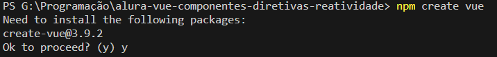
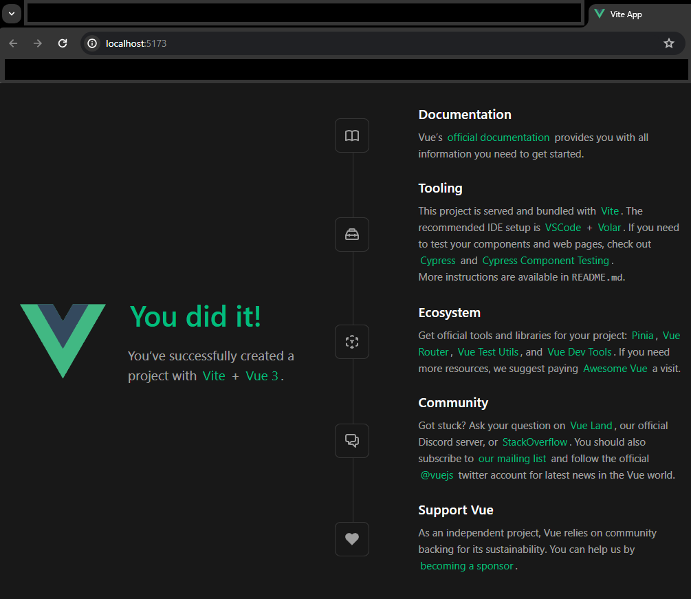

# Curso  : Vue 3 - Componentes, Diretivas e Reatividade no Framework
Repositório para guardas as anotações e prática do curso da Alura Vue 3: Entendendo Componentes, Diretivas e Reatividade no Framework

| :placard: Vitrine.Dev |     |
| -------------  | --- |
| :sparkles: Nome        | **Curso Alura : Vue 3 - Componentes, Diretivas e Reatividade no Framework**
| :label: Tecnologias | TypeScript, VueJs
| :rocket: URL         | 

<!-- Inserir imagem com a #vitrinedev ao final do link -->


## 🗈 Detalhes do projeto
Este projeto é o meu primeiro contato com o Framework Vue.


### Iniciando um projeto Vue
1. É necessário ter o __Node__ instalado;
2. Na linha de comando do diretório inicial, usar o comando ```npm create vue```;
3. Como nenhuma versão específica do Vue foi exigida no comando, ele pedirá para confirmar a versão mais recente (no meu caso a @3.9.2).

4. Ao confirmar, as perguntas básicas de criação de projeto serão apresentadas:

5. O projeto será criado na pasta com o nome informado ("Project name", no meu caso, "cookin-up") e serão apresentadas os próximos comandos para abrir o projeto e instalar as dependências iniciais:

```cmd
<!-- No prompt de comando -->
cd cookin-up
npm install
npm run format
npm run dev
```
6. Ao inserir os comandos, um servidor local será criado, na porta __5173__ o app básico será iniciado:


<a href="#" style="display:flex; justify-content: end"> ⬆️Topo⬆️</a>


### Extensões Úteis do VSCode
O instrutor recomenda a instalação das seguintes extensões do VSCode para facilitar o trabalho com o framework Vue:
- Vue Language Features (Volar)
- TypeScript Vue Plugin (Volar)

<a href="#" style="display:flex; justify-content: end"> ⬆️Topo⬆️</a>


## 📀 Para rodar o projeto
- Clonar o repositório;

<a href="#" style="display:flex; justify-content: end"> ⬆️Topo⬆️</a>

## Links
- A parte prática do curso envolve o desenvolvimento de um aplicativo chamado CookinUp. [Este é o arquivo Figma do Projeto](https://www.figma.com/file/J4J2EY9BDJKYueH7QGrsnz/Cookin'UP-%7C-Vue-1-(Copy)?type=design&node-id=1901-2&mode=design&t=odeZYaNpiVTuXDSt-0)

<a href="#" style="display:flex; justify-content: end"> ⬆️Topo⬆️</a>